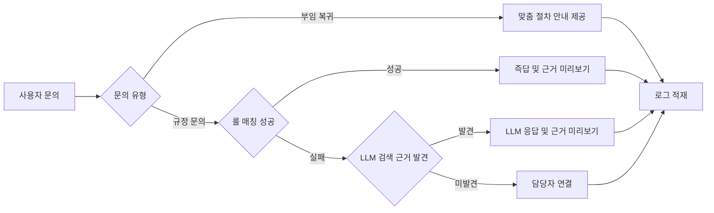

# PRD: 글로벌 인사관리 챗봇 (Phase 1)

*국외근무직원 부임·복귀 안내 + 보수·복지 HR Q&A*

## 1. Summary

국외 주재원의 부임·복귀 절차와 보수·복지 규정 문의를 챗봇이 1차로 응대해, 담당자가 반복 업무 대신 검증·예외관리 같은 고부가 업무를 하도록 돕는 프로젝트입니다. 담당자가 먼저 써서 검증한 뒤, 검증되면 주재원이 직접 쓰는 셀프서비스로 넓힙니다.

## 2. Background

글로벌사업그룹은 두 부서로 나뉩니다. **글로벌성장지원부**는 인도네시아·캄보디아 등 국외 지분투자 자회사를 관리하고, **글로벌추진부**는 런던·홍콩 지점처럼 유기적으로 성장한 국외점포를 관리합니다.

지금은 국외 주재원이 부임·복귀 절차나 보수·복지 규정을 물어보면 담당자가 매번 직접 찾아서 답합니다. 같은 질문이 반복되고, 국가별 안내 자료 형식도 제각각입니다.

## 3. Objective

**목적**: 반복 문의를 챗봇이 대신 응대해 담당자의 업무 부담을 줄이고, 담당자는 검증·예외관리에 집중하게 합니다.

**기대 효과**:
- 담당자: 반복 응대 시간 절감, 규정 해석의 일관성 확보
- 회사: 부서 업무 지식(암묵지)의 체계적 축적과 공유
- 주재원(Phase 2 이후): 대기 없이 바로 답을 얻는 셀프서비스 경험

## 4. 성공 지표 (KPI)

| 지표 | 현재 | 목표 | 측정 방법 |
|---|---|---|---|
| 반복 문의 응대 시간 | 미측정 | baseline 대비 유의미하게 단축 (baseline은 파일럿 전 2주간 측정) | 담당자 문의 로그 |
| 챗봇 자가해결률 | - | 담당자 개입 없이 종료 60% 이상 | 챗봇 세션 로그 |
| LLM 오답·오인용 건수 | - | 담당자 검증 기간 중 0건 | 담당자 검수 결과 |
| 담당자 챗봇 활용률 | 0% (신규 도구) | 전체 문의 건수 중 챗봇을 거쳐 처리된 비율 80% 이상 | 챗봇 세션 로그 대비 전체 문의 건수 |

## 5. Market Segment(s)

| 단계 | 대상 | 왜 |
|---|---|---|
| Phase 1 | 글로벌성장지원부·글로벌추진부 **담당자** | 실사용을 통한 정확도 검증. 아직 주재원에게 바로 노출하기엔 리스크가 큼 |
| Phase 2 | **국외점포 주재원** (organic·inorganic 모두) | Phase 1 검증 통과 후 셀프서비스로 확대 |

**제약 조건**: 국가마다(인도네시아, 캄보디아, 런던, 홍콩 등) 규정이 다르고, 같은 국가라도 organic(지점)과 inorganic(현지법인) 적용 규정이 다를 수 있습니다. 사내 망분리 환경으로, 내부망 안에서만 개발·운영합니다.

## 6. Value Proposition(s)

**담당자 관점**
- 지금: 문의가 올 때마다 규정을 찾아 처음부터 답변을 작성함
- 앞으로: 챗봇이 초안을 만들고, 담당자는 검수만 하면 됨
- 피하게 되는 불편: 같은 질문에 매번 답하는 반복 노동, 국가별 자료 형식 정리 부담

**주재원 관점 (Phase 2)**
- 지금: 궁금한 게 있어도 담당자 응답을 기다려야 함
- 앞으로: 국가와 소속(organic/inorganic)만 선택하면 바로 맞춤 답을 받음
- 피하게 되는 불편: 잘못된 정보로 인한 재문의, 응답 대기 시간

**차별점**: 대부분의 사내 챗봇은 그럴듯하지만 틀린 답을 내놓는 게 문제입니다. 이 챗봇은 **룰(규정 확정 사항)로 먼저 정확히 답하고, 애매한 경우만 규정 원문을 검색해 LLM이 근거와 함께 답하며, 그마저 근거가 없으면 솔직하게 "모른다"고 하고 담당자에게 넘깁니다.** 오답보다 모른다는 답이 안전하다는 원칙을 지킵니다.

## 7. Solution

### 7.1 UX / Prototypes

**응답 처리 흐름**

편집이 필요하면 [FigJam 원본](https://www.figma.com/board/N1WB8jwosvOlskQA24ZcZB)에서 직접 수정할 수 있습니다.

**근거문서 미리보기 목업**: 답변에 인용된 규정 조항을 클릭하면 원문 문서가 하이라이트되며 스크롤되는 화면 개념을 프로토타입으로 제작

### 7.2 Key Features

| 기능 | 설명 |
|---|---|
| 부임·복귀 안내 | 국가·소속유형 선택 시 맞춤 체크리스트, 필요서류, 단계별 절차 안내 |
| 규정 Q&A (룰 우선) | 자주 묻는 질문은 룰 기반으로 즉시, 정확하게 응답 |
| 규정 Q&A (LLM 보완) | 룰로 못 찾으면 LLM이 규정 문서를 검색해 답변 생성 (문서 밖 내용은 만들어내지 않음) |
| 근거문서 미리보기 | 모든 답변에 근거가 된 규정 조항 원문을 바로 확인할 수 있게 제공 |
| 담당자 에스컬레이션 | 근거를 못 찾으면 답을 지어내지 않고 담당자에게 연결 |
| 문의 로그 | 자주 나오는 질문과 LLM 사용 빈도를 기록해 향후 FAQ 보강에 활용 |

### 7.3 Technology

룰 엔진(결정형 매칭) + 규정 문서 검색(RAG) + LLM 응답 생성의 3단 구조입니다. 챗봇·에이전트 자체는 직접 구축하며, 새 LLM 모델을 학습하지 않고 사내에 이미 구축된 기존 LLM 모델만 가져와 사용합니다. 사내 망분리 내부망 환경에서 개발·운영합니다.

### 7.4 Assumptions

- 파일럿 국가는 인도네시아로 가정 (미확정, 팀 논의 후 확정)
- 담당자가 실제 업무에 챗봇을 사용하도록 워크플로우에 편입할 수 있다고 가정 (아니면 로그가 안 쌓여 검증이 안 됨)
- 사내 기존 LLM 모델을 이 용도로 가져와 쓸 수 있다고 가정 (권한·비용 확인 필요)

## 8. Release

| 단계 | 기간(안) | 내용 |
|---|---|---|
| Phase 0 | 약 2주 | 파일럿 국가 확정, 안내서·FAQ 표준양식 정리, baseline 측정 시작 |
| Phase 1 | 약 3~4주 | 담당자 전용 파일럿 구축 및 검증 |
| Phase 2 | 검증 통과 후 | 국외점포 주재원 대상으로 확대 |
| 향후 검토 (범위 밖) | - | 계약서 검토·시행문 자동생성, 국외출장 관리 — 별도 프로젝트로 추후 진행 |
